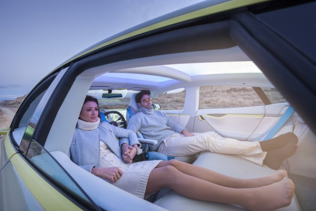

There's so much buzz these days about autonomous vehicles aka self-driving cars. [Google](https://www.google.com/selfdrivingcar/) is working on one, Apple is [allegedly](https://www.google.com/webhp?sourceid=chrome-instant&ion=1&espv=2&ie=UTF-8#q=apple%20autonomous%20car) working on one and [Tesla](http://fortune.com/2015/12/21/elon-musk-interview/) is making some strides in that direction as well. Quite frankly I can't wait for that day to arrive, not just when they're available for purchase but when we ALL have one and it's commonplace. Hopefully at some point there will be a law that mandates the demise of human-driven vehicles on public roads as well. Maybe just limited to private roads which would include racetracks etc.

*[Image Source](http://www.electronicproducts.com/Electromechanical_Components/Motors_and_Controllers/This_is_the_future_of_driving_Autonomous_Tesla_car_is_a_lounge_on_four_wheels.aspx?terms=cars)*

Why am I so excited for this day? Think of some of the benefits it'll bring...

1. **No traffic**. All vehicles are essentially robots filled with sensors and interconnected so they can all sense and communicate with each other  harmoniously. Speed limits could be lifted on roadways with no pedestrians. Being robots they lack the properties that lead to traffic and congestion today, namely, human emotions and human distractions.
2. **Faster commuting**. No traffic = fast transport
3. **Cleaner environment**. An autonomous vehicle by definition doesn't have to be electric but that's the running assumption I'm making and the direction the industry is going. In a world with all electric vehicles, we have no exhaust fumes coming from engines; less moving parts means less maintenance. Imagine being dropped off by your personal autonomous vehicle, then it navigates away to the nearest charging station (likely solar powered) to wait until you summon it again for your next trip.
4. **Time back**. How many hours do we spend driving each day, week, month, year? That's all time that could be spent reading, learning and doing more valuable things than driving a car. Granted given #1 and #2 above we'll have  less time in our vehicles but regardless, that's time not spent on the mundane task of driving.
5. **Happier People**. This one is a bit of a stretch but it could be argued that less road rage and less time spent behind a vehicle all day could lead to a reduction in stress. I'll buy that argument.

It may sound like I don't like driving which is quite the contrary but after a while driving becomes a very mundane and repetitive task. That's where the opportunity lies to do something else with that time. I dislike the feeling that driving today is mandatory, i.e. I can't get from my house to work unless I get into my car and drive there, or hop on public transportation (a bus) which takes 90 minutes due to traffic.

When this day arrives it'll be a completely different world as we know it. It would change us in many ways and force us to evolve into new industries and ways of living. Certain jobs will be forced to change, we'll see socioeconomic shifts as well as the entire transportation industry is massively disrupted, IMHO for the better. 

I don't know when this day will come, but I hope it's in my lifetime. It's not going to happen overnight but I'm encouraged everyday by the advancements I see being done by the pioneering companies I listed in the beginning of the article.

See you on the road,

_Alan_
